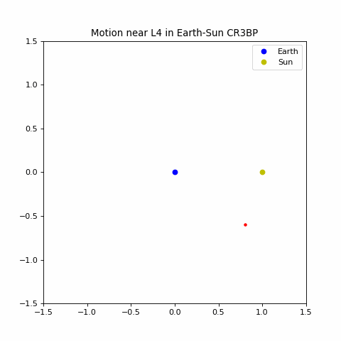

# Lagrange Point Simulator 🛰️🌍☀️

This is a Python-based simulation of the **Circular Restricted Three-Body Problem (CR3BP)**, focused on visualising the **Earth–Sun system** and its **Lagrange points**, particularly **L1–L5**. The simulation includes interactive sliders to control time, initial position, and velocity — offering a dynamic way to explore orbital mechanics.

---

## 🚀 Features

- Models the Earth and Sun in the CR3BP.
- Simulates the motion of a third object with negligible mass (e.g., a satellite).
- Interactive sliders for:
  - Start position (`x`, `y`)
  - Initial velocity (`vx`, `vy`)
  - Time span and resolution
- Real-time animated trajectory
- Visual indicators for Lagrange points (L1–L5)
- Optional: trails, key/legend, vector fields (depending on version)

---

## 📦 Installation

Make sure you have Python 3.7+ and Jupyter Notebook installed.

Install dependencies:

```bash
pip install numpy scipy matplotlib ipywidgets

